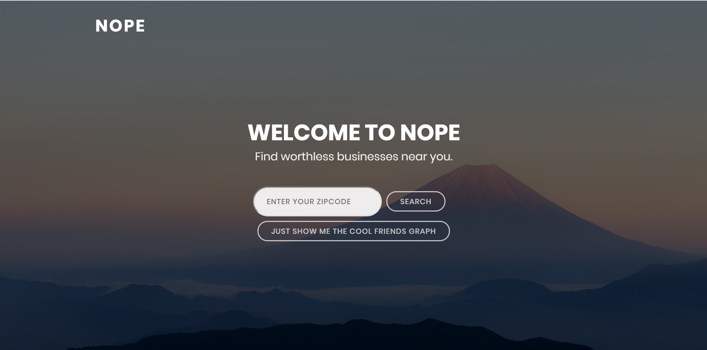
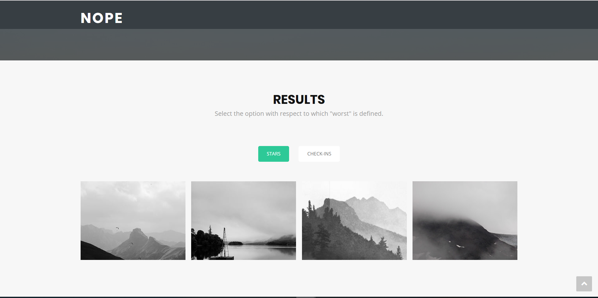
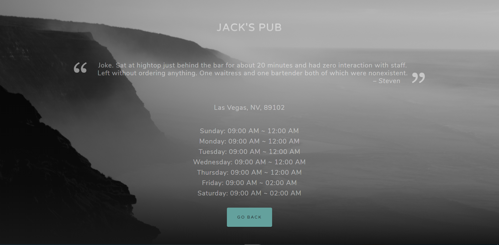
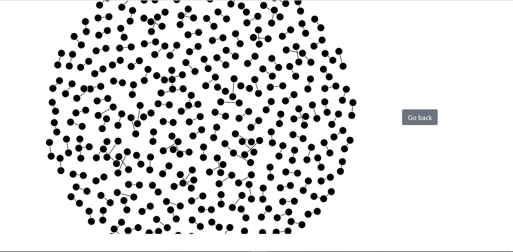

## Nope:  Explore Worthless Businesses Near You.
## A Database Project
#### Wei Luo
Nope is an website that lets you explore worthless businesses near you.  Given a zipcode and after choosing how "worthless" is defined (such as count of stars and count of checkins), we return the most worthless businesses.
For this project, I went through the following process:
1. Collect and clean data from [Yelp](https://www.yelp.com/dataset).
2. Draw ER diagrams to represent the relations between entities that correspond to the data collected.
3. Write DDLs to create relations and insert data using PostgreSql.
4. Use Flask, SQLAlchemy, Postgresql for backend, D3, jQuery and Bootstrap for frontend to create the website. 

The following are some screenshots from the websites:
* Homepage

* Selecting how "worthless" is defined

* Results page

* Friendship graph


You can run the website using 
```
python server.py
```
and navigate to 
```
http://[EXTERNAL_IP]:8111/
```
However, keep in mind that the website does need to connect to the original database, which may or may not be still up.
